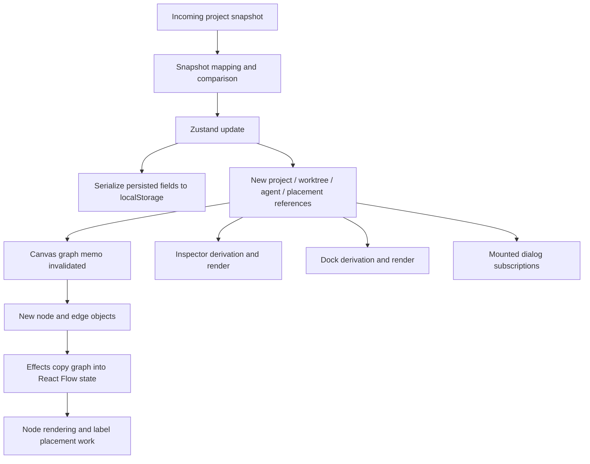

# Bonsai React architecture and update behavior

**Implementation progress — 2026-10-04**

Tasks follow the rows in “Recommended sequence and change impact” below. The review that follows describes the earlier baseline, not the current implementation.

- Task 1 — Keep main workspace ancestry stable during dock collapse: complete. The implementation was already included in checkpoint `5387e31`. Verified stable main/dock mounts, retained route drafts and canvas viewport, restored normal height, hidden-dock focus handling, and deferred terminal measurements. Extended the Strict Mode lifecycle test to cover normal, collapsed, and maximized startup states. Validation: 8 component/terminal tests and 4 browser lifecycle tests passed; the browser suite also built and typechecked the frontend.
- Task 2 — Correct runtime-selection dependencies and add Hooks linting: complete. Both implementations were already included in checkpoint `5387e31`: selection depends on the preferred runtime ID, whether it needs opening, and the stable action; Hooks rules run as errors locally and in frontend CI. Reviewed the two documented dependency exceptions for dialog initialization and topology-driven layout. Added regression coverage for other-worktree arrivals, worktree switching, healthy-runtime preference, and preserving a valid user selection through health changes. Validation: 47 runtime/store/dialog tests passed; the 6 runtime tests passed again after correcting the new fixture's health type; typecheck and lint passed. Hosted CI was not run.
- Task 3 — Preserve unchanged store/entity references during snapshot application: complete. Reviewed the existing pure reconciliation, narrow patches, project selectors, and transport/selection boundary. Added regression coverage for reordered/deleted worktrees retaining surviving entity references and repeated snapshots producing no notification. Fixed a reproduced deletion gap: snapshot removal now clears the deleted worktree's collapsed-branch preference while preserving surviving IDs and placement objects. Validation: 32 snapshot, transport, file-refresh, and worktree-management tests passed; typecheck, lint, and the browser render-isolation test passed. The browser test uses direct store updates and measured zero graph/label calculations and workspace Profiler commits for process-only and inactive-project updates; component tests cover the actual snapshot application path.
- Task 4 — Separate live state from persisted preferences and avoid resize-time storage churn: complete. Verified the existing preference allowlist, equal-payload guard, deferred layout writes, resize-completion commit, and navigation/page lifecycle flushing. Fixed a reproduced recovery gap: failed writes now remain pending for explicit or lifecycle retry, without a retry timer or writes driven by live updates. Added coverage for failed-save recovery, hidden-tab flushing, and visibility-listener cleanup. Validation: 36 persistence/lifecycle component tests and 7 browser storage/lifecycle tests passed; lint passed and the browser suite built/typechecked the frontend. Browser coverage confirms one completed resize write and restoration after immediate navigation/reload.
- Task 5 — Reconcile graph nodes by ID and separate geometry from status/selection: complete. Verified the existing node/edge reconciliation retains unchanged data, selection, measured dimensions, and local drag positions. Added coverage proving changed edge display data is published while reusing label placement. All 37 graph/layout tests passed, including drag, history sizing, and topology invalidation; browser auto-layout, stack expansion, and render-isolation coverage passed.
- Task 6 — Narrow inspector/dock subscriptions, index branch data, and gate expensive dialog bodies: complete. Verified existing branch/agent indexes, row-level subscriptions, cycle protection, file/content separation, and dialog gates. Fixed Inspector updates caused by unrelated group preferences by selecting only the current group's collapsed boolean; memoized the project agent list against its stable input. A regression test reproduced the unnecessary commit before the fix and now verifies unrelated preferences/output remain quiet while the selected group still updates. Branch, file, dialog, and browser Inspector tests passed.
- Task 7 — Add further memoization, route splitting, or virtualization where measurements justify them: complete for the measured scenarios. Retained existing node, branch-row, and file-tree memo boundaries and the lazy public/application split. The profiling results below do not justify further render memoization or virtualization for this fixture. The production application chunk is 702.68 kB (217.71 kB gzip), with Vite's size warning; route/startup timing and representative large-tree benchmarks remain separate measurement work before choosing further splitting or virtualization.

**Final validation — 2026-10-04**

All 174 tests in 27 Vitest files, all 29 Chromium browser tests, Hooks linting, and the production build/typecheck passed. Hosted CI was not run. Browser APIs are mocked; these results do not establish real-backend or large-dataset performance.

The production profiling build recorded the following deltas using the existing multi-project browser fixture. The Profiler covers routed main-workspace content, not the Inspector or dock. Updates in this browser measurement use the test store directly; snapshot-path isolation is covered by component tests. Durations are observations from one run, not performance thresholds.

| Update | Graph builds | Label calculations | Workspace commits | React duration (ms) | Storage writes | API requests |
| --- | ---: | ---: | ---: | ---: | ---: | ---: |
| Process only | 0 | 0 | 0 | 0 | 0 | 0 |
| Inactive project | 0 | 0 | 0 | 0 | 0 | 0 |
| Selection only | 0 | 0 | 4 | 2.1 | 1 | 4 |
| Worktree status | 1 | 0 | 3 | 1.1 | 0 | 0 |

Selection intentionally persists a preference and updates dependent file/PR views. Resize, dock collapse, route drafts, storage migration/recovery, history expansion, and auto-layout are covered by the passing browser suites. The original review below is retained as historical context.

Updated review: 2026-10-02, commit `49e973e` plus the current uncommitted frontend changes. Scope: React component structure, Zustand subscriptions, re-renders, prop drilling, effects, persistence, and asynchronous UI updates. This complements [report.md](report.md); backend architecture is outside this report.

**Overall React grade: D — 5/10. Complexity: high — 8/10.** The main problem is overly broad update propagation. Prop drilling exists in recursive trees, but most components read Zustand directly. The highest-value improvements are preserving unchanged data references, keeping the workspace mounted, and separating frequently updated state from browser persistence.

| Dimension | Grade | Reason |
| --- | --- | --- |
| Render isolation | 4/10 | Small snapshot changes replace unrelated collections and canvas inputs. |
| Prop boundaries | 7/10 | Most props are local and reasonable; recursive branch/file trees need better data boundaries. |
| State ownership | 5/10 | Server entities, layout, selection, form-adjacent state, and persistence share one store. |
| Effects and component lifecycle | 5/10 | Cleanup and some no-op guards exist; workspace remounting and incomplete effect dependencies remain. |
| Recent update fixes | 7/10 | File refresh stability and check keys improve behavior, but do not isolate rendering by entity. |

Grades are qualitative. A render is a component execution; it does not necessarily produce DOM changes. A remount destroys and recreates component state/effects. Neither a hook count nor a line count is a measured performance result.

**What was measured**

A temporary React Testing Library/Vitest probe used the real `applySnapshot` and Zustand store. It applied an initial one-worktree snapshot, mounted five independent selector consumers, then applied a snapshot whose only payload change was one new process. No Strict Mode wrapper was used for this probe.

| Selected state | Additional component renders from the process update |
| --- | ---: |
| `projects` | 1 |
| `worktrees` | 1 |
| `agents` | 1 |
| `nodePlacements` | 1 |
| `gitRevision` | 0 |
| Browser persistence | 1 `Storage.setItem` call |

The first four selected values were semantically unchanged but received new references. The unchanged file revision confirms that the recent invalidation fix works while unrelated selector consumers still render. These are counts for small probe components, **not profiler counts for the full canvas or production timing measurements**. The temporary probe was removed after execution.

The installed Zustand React adapter uses `useSyncExternalStore`; its persistence middleware writes after wrapped store updates. Both implementations were inspected locally. A component with several selectors does not necessarily render once per selector: batching and snapshot equality matter. Stable action selectors are generally not the problem here.

**Where updates spread**



This diagram describes the broad semantic-change path. The code does have a no-op/freshness-only path, so not every incoming snapshot follows the entire chain.

**1. High impact: a small snapshot change replaces too much state**

In [git.ts](web/src/api/git.ts), `snapshotPatch` constructs new `projects`, `worktrees`, `processes`, `pullRequests`, and `agents` arrays, plus a new `nodePlacements` object and several other collections. If any field in its semantic comparison changes, it returns the broad patch. A process-only update therefore publishes newly allocated arrays even when the worktrees or agents did not change.

[BonsaiCanvas.tsx](web/src/features/workspace/canvas/BonsaiCanvas.tsx), [Inspector.tsx](web/src/features/inspector/Inspector.tsx), and multiple components in [BottomWorkspace.tsx](web/src/features/terminal/BottomWorkspace.tsx) subscribe to entire collections. An inactive project's update can consequently invalidate calculations for the active project. Filtering after subscribing does not narrow the subscription.

**Recommended change:** preserve existing entity objects and collection references when their contents are unchanged. Then expose stable project/worktree-specific selectors or indexed entity state. This tackles the cause before adding component memoization.

**Complexity: high. Impact: high.** Preserve deletion cleanup, selection behavior, epoch/sequence guards, and pending worktree selection while extracting this mapping. Wholesale store replacement would carry unnecessary regression risk.

**2. High impact: the canvas rebuilds and republishes node data too broadly**

The graph memo in [BonsaiCanvas.tsx](web/src/features/workspace/canvas/BonsaiCanvas.tsx) depends on full collections and the whole placement/environment maps. It creates new nodes, nested `data` objects, arrays, edge styles, and edges. A following effect maps every graph node to another new object while carrying over only its measured dimensions. Another effect copies the edge array into local state.

Consequences include repeated graph construction and another state-update phase before React Flow settles. `displayEdges` also recalculates label placement whenever the nodes array changes, including selection changes that do not change geometry. [prLabels.ts](web/src/features/workspace/canvas/layout/prLabels.ts) performs obstacle checks, so this is more substantial than an inexpensive property lookup.

The registered node components in [BonsaiNode.tsx](web/src/features/workspace/nodes/BonsaiNode.tsx) have no explicit `React.memo` boundary. Simply wrapping them would have limited value while every graph rebuild replaces their `data` props. React Flow has its own update machinery; this review does not claim that every node paints on every canvas render.

**Recommended change:** distinguish topology, geometry, selection, and display-data updates. Reconcile nodes/edges by ID and retain unchanged objects; update only the affected node data. Key label placement to geometry changes. Add memoization at expensive leaf boundaries once their inputs are stable.

**Complexity: high. Impact: high for larger graphs.** Keep the existing topology/placement guards: the current code already avoids running full auto-layout for every status change. Broad graph rebuilding and repeated full auto-layout are different problems.

**3. High impact: collapsing the dock remounts the main workspace**

[AppShell.tsx](web/src/components/layout/AppShell.tsx) switches between these structures:

```text
collapsed: MainWorkspace -> routed content + Inspector
expanded:  PanelGroup -> Panel -> MainWorkspace -> routed content + Inspector
```

The ancestor type changes, so React cannot preserve that subtree by its previous position. This is a component lifecycle reset, beyond an ordinary re-render. On the workspace route it recreates `ReactFlowProvider`, canvas effects, local node state, and layout refs. Other routes can lose local search/form state; expanding the dock also recreates its components. Persisted Zustand values survive, but component-local state does not.

Canvas mounting also runs its initial synchronization effect again. Server coalescing may suppress duplicate work, but it does not eliminate the client lifecycle reset.

**Recommended change:** retain the same panel/component hierarchy and collapse or hide the dock within it. Explicitly choose which terminal resources should remain mounted. Add a lifecycle test asserting that toggling the dock preserves the main canvas instance and route-local inputs.

**Complexity: medium. Impact: high for state continuity.** This finding follows directly from the JSX structure; a complete browser mount/unmount trace was not recorded.

**4. High impact: persistence runs on live updates and resizing**

[bonsai.ts](web/src/stores/bonsai.ts) wraps the shared store in `persist`. `partialize` chooses fields to serialize; it does not make persistence conditional on those fields changing. The installed middleware calls storage after both action-driven `set` and public `setState`. The process-only probe confirmed a storage write despite unchanged user preferences.

The persisted payload includes placements, board data, agents, and environment variables. [AppShell.tsx](web/src/components/layout/AppShell.tsx) writes `dockHeight` from panel resize callbacks, and observes that same value to call imperative `resize`. The setter clamps the value without an equality guard. This creates unnecessary opportunities for state notifications, serialization, and layout work during dragging; it does **not** prove an infinite resize loop.

**Recommended change:** separate persisted preferences from live entities; persist resize/placement preferences at deliberate commit points or debounce them. Add equality guards and isolate the resize controller from unrelated shell content. Check pending persistence on teardown if using debounce.

**Complexity: medium. Impact: medium–high**, especially as persisted data grows. Even store actions that return the existing state can still reach this middleware's storage write, so React no-op guards alone are insufficient.

**5. Correctness issue: newly arriving runtimes may not trigger selection**

The runtime-selection effect in [BottomWorkspace.tsx](web/src/features/terminal/BottomWorkspace.tsx), `RuntimeWorkspace`, reads `available`, `availableMap`, and `openEntries`, but depends only on worktree ID, dock runtime ID, and joined open runtime IDs.

When a worktree initially has no runtime, the effect returns. If a process subsequently appears without those three dependencies changing, the component renders new availability but the effect does not run again to select/open it. This is an update-dependency defect, rather than a problem solved by reducing renders.

**Recommended change:** derive a stable preferred runtime ID and whether it needs opening; make the effect depend on those values and the action. Avoid adding a newly allocated `available` array directly as a dependency without stabilizing it. Add a regression test for “empty runtime list, then first process arrives.”

**Complexity: low–medium. Impact: medium.** The trigger is identified from the source; it was not reproduced in a browser during this report.

**Prop drilling: localized, with two meaningful hotspots**

| Component chain | Assessment | Improvement |
| --- | --- | --- |
| `BranchSidebar -> BranchTreeItem -> BranchTreeItem` | The strongest example. Each recursive item receives the full worktree/agent arrays, selection, callbacks, and a visited set. Each item scans the arrays again. It also subscribes to the entire collapsed-ID array. | Build parent-to-children and worktree-to-agent indexes once. Pass an ID or stable branch view model; subscribe to this row's collapsed/selected boolean. Keep cycle protection. |
| `FilesPage -> TreeNode -> TreeNode` | Normal recursive composition, but `selectedPath` changes for every row, and content-loading state lives in the same page as the tree. All expanded descendants are eligible for render work when the page renders. | Separate the file tree and content viewer. Use stable tree data and row-level selected state where scale justifies it. |
| `BonsaiCanvas -> ReactFlow -> Node -> NodeShell` | A graph renderer's ordinary data interface. Passing `data` and `selected` through these layers is reasonable. | Stabilize data identity and narrow updates; replacing props with global state everywhere would add coupling. |
| `Inspector -> Section / Metric / AgentRow` | Short, understandable props. No demonstrated drilling problem. | Keep the props; separate project/worktree/agent inspector containers to narrow subscriptions and derivations. |

The branch tree repeatedly filters W worktrees and A agents for each visible branch, giving roughly O(W² + W×A) derivation work when W branches are rendered. Tree depth and collapsed state affect actual cost. Precomputed indexes reduce repeated scans without changing the UI model.

Many components already avoid drilling by importing the global store, which trades explicit props for implicit dependencies. A universal Context provider would not automatically improve render isolation.

A useful row subscription pattern already appears elsewhere in the app:

```tsx
const collapsed = useBonsaiStore(s => s.collapsedBranchIds.includes(worktreeId))
const selected = useBonsaiStore(s => s.dockWorktreeId === worktreeId)
const toggle = useBonsaiStore(s => s.toggleBranchCollapsed)
```

This narrows store-driven updates to boolean changes. It does not prevent parent-driven renders by itself. Stable props and a measured need for `memo` are separate considerations. For collection selectors, avoid returning a fresh `filter()` result directly from the plain Zustand selector; use a stable derived collection or an appropriate shallow selector wrapper.

**Memoization and effects that deserve attention**

| Location | Current issue | Practical response |
| --- | --- | --- |
| [CreateWorktreeDialog.tsx](web/src/features/workspace/CreateWorktreeDialog.tsx) | `projectWorktrees` is filtered on every render, so the memo depending on that array recomputes; downstream branch memos follow. This happens before the closed-dialog return. | Stabilize the project subset first. Split a small open-state gate from the mounted dialog body if draft-reset semantics permit it. |
| [usePullRequestCatalog.ts](web/src/features/github/usePullRequestCatalog.ts) | It returns a new rows array each render. PR-page/panel memos depending on it cannot reuse their previous calculation when unrelated local input state changes. | Memoize catalog derivation against stable project data and separate list search state from detail/review state. |
| [Inspector.tsx](web/src/features/inspector/Inspector.tsx) | Subscribes to all terminal output and several global arrays; even a tag-input change rebuilds project attention/agent lists. | Use selection-specific containers and selected-terminal output; memoize substantive derived lists after stabilizing their inputs. |
| [AppShell.tsx](web/src/components/layout/AppShell.tsx) | Notice creation/clearing and dock height changes render the shell and its directly instantiated children. Hidden dialogs still subscribe while returning `null`. | Move notices into a small subscriber; isolate panel controls and mount expensive dialog bodies only when needed. Do not assume routed `children` necessarily re-render merely because the shell does. |
| [BonsaiCanvas.tsx](web/src/features/workspace/canvas/BonsaiCanvas.tsx) | Event handlers and `proOptions` objects are recreated during render. | Stabilize expensive-library boundary props where profiling supports it, after fixing broad graph updates. Inline callbacks alone are not a defect. |
| [FilesPage.tsx](web/src/features/files/FilesPage.tsx) / dock file panel | Tree flattening/filtering repeats during renders; mounted hook instances independently fetch the same data. | Share worktree-keyed data and derived indexes. Consider virtualization only after testing representative large trees. |

There is no configured React Hooks lint check in the inspected package scripts/configuration. TypeScript does not catch missing effect dependencies. Add an explicit Hooks lint step, while retaining documented semantic dependencies where an effect deliberately initializes only on opening or topology change. Blindly adding all unstable objects to dependency lists can create more repeated work.

**What is already good**

- Most store reads use selectors rather than subscribing to the whole store. Action functions are generally stable.
- `SortableRuntimeTile` selects its own active boolean. `NodeShell` selects whether its own history is expanded and, for agents, the matching agent object. These are useful patterns to extend.
- Canvas node/edge type registries live outside render. Selection updates retain unchanged node objects, and placement setters contain no-op guards.
- Canvas topology guards distinguish placement changes from ordinary status updates. Preserve them during refactoring.
- Network hooks reject stale completions after target changes. Connection clients use `useSyncExternalStore`, and observer/timer cleanup exists in the inspected terminal and shell code.
- The public landing page and application are lazily separated. Form drafts often use local React state, which is appropriate.
- Development Strict Mode is intentional. Extra development executions alone are not evidence of a production render regression.

**Impact of the latest frontend changes**

| Pending change | Improvement | Remaining limitation |
| --- | --- | --- |
| `gitRevision` changes only when local worktree payload changes | CI/process updates no longer automatically retrigger file/diff hooks. Verified by tests and the probe. | One global revision still invalidates mounted file hooks for other worktrees. It does not preserve other array/object references. |
| File/content/diff state is keyed to its target and retained during refresh | Avoids clearing visible results on every same-target refresh; hides data belonging to a different target. | Each hook instance has its own request/state; requests are ignored after cleanup rather than aborted. A same-target failed refresh may retain old data without component-level freshness state. |
| Check IDs are propagated into React keys | Duplicate check names no longer necessarily collide; identity is better preserved when IDs exist. | Name/index fallback is less stable under reorder. Keys preserve identity but do not prevent ordinary re-renders. |

These are worthwhile fixes. The updated assessment is that file refresh flicker has improved, while **render isolation is still poor**. The next change should preserve identities and isolate update ownership, rather than adding `useMemo` indiscriminately.

**Recommended sequence and change impact**

| Priority | Change | Complexity | Impact and validation |
| --- | --- | --- | --- |
| P1 | Keep main workspace ancestry stable during dock collapse. | Medium | Preserves local state/effects; test mount count and draft/viewport continuity. |
| P1 | Correct runtime-selection effect dependencies and add Hooks linting. | Low–medium | Makes newly arriving runtimes selectable automatically; test the empty-to-populated transition. |
| P1 | Preserve unchanged store/entity references during snapshot application. | High | Reduces update fanout at its source; test process-only, inactive-project, CI-only, and identical snapshots. |
| P2 | Separate live state from persisted preferences and avoid resize-time storage churn. | Medium | Reduces synchronous serialization; count storage writes during live updates and resizing. |
| P2 | Reconcile graph nodes by ID; separate geometry from status/selection. | High | Reduces graph/label work; profile drag, selection, and one-worktree updates without regressing layout. |
| P2 | Narrow inspector/dock subscriptions, index branch data, and gate expensive dialog bodies. | Medium | Reduces unrelated rendering and repeated scans; check input/draft behavior after extraction. |
| P3 | Add memo boundaries, route splitting, or virtualization where measurements justify them. | Medium | Target remaining CPU/startup/DOM costs after data identity is fixed. |

**Validation and remaining measurement work**

This review ran the temporary render/storage probe plus `gitFileRefresh.test.ts`, `files.test.tsx`, and `checkKeys.test.tsx`: **4 test files, 12 tests passed**. After removing the probe, the repository retains the 11 existing tests from those three files. No application source was changed for this report.

No full-browser React Profiler trace or frame-time benchmark was captured. Next, profile a fixed representative multi-project dataset while changing one process, changing an inactive project, selecting a node, dragging a subtree, resizing/collapsing the dock, and receiving the first runtime. Record React commits and duration separately from graph/label calculations, HTTP requests, mounts, and storage writes. Compare production/profiling builds consistently; do not use development Strict Mode render counts as a latency benchmark.

The acceptance target is specific: a process update should preserve unchanged worktree and placement references; an inactive-project update should avoid rebuilding the active graph; dock collapse should preserve the main workspace instance; and transient live updates should not rewrite saved preferences.
