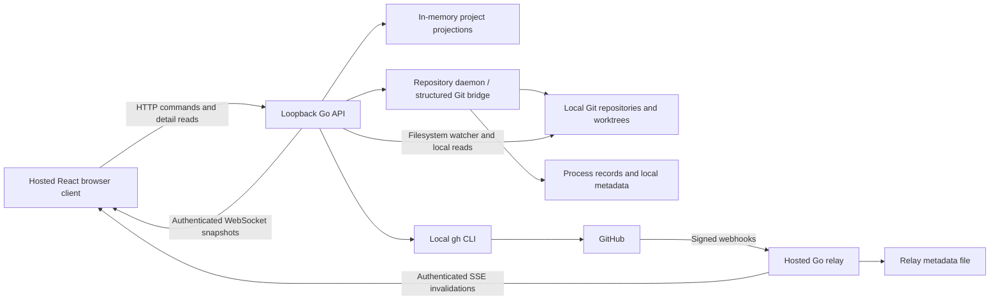

# Bonsai website architecture review

Reviewed on 2026-10-02 at commit `49e973e`, including the existing uncommitted changes. This is a source-based review of the browser client, local server, daemon boundary, and hosted relay. “Impact of the change” means this branch versus the local `main` merge base (`9993815`), with the working-tree fixes assessed separately. No remote branch freshness was verified.

**Overall grade: C — 6/10. Complexity: high — 8/10. Change impact: high.**

The architecture has a sensible trust boundary and substantial correctness work around Git state. Its main weakness is inconsistent maturity: real repository operations share a client with simulated agents and terminals, while synchronization and presentation responsibilities are concentrated in large modules. The branch improves correctness and functionality, but increases the number of interacting state machines and operational assumptions.

These grades are engineering judgments, not benchmark scores. An A would require clear ownership, truthful product behavior, bounded resource use, and integration evidence across the real client/server boundary. Passing tests alone does not establish those properties.

| Area | Grade | Assessment |
| --- | --- | --- |
| Browser client | D — 5/10 | Useful feature organization and layout modules, undermined by a large mixed-purpose store, simulated operational features, and expensive snapshot mapping. |
| Local API and Git boundary | B — 7/10 | Structured mutations, ordering guards, partial failure handling, and good targeted tests; orchestration and lifecycle management remain complicated. |
| Hosted relay | B — 7/10 | Narrow authority and isolated responsibilities; file-backed persistence limits deployment and throughput. |
| State synchronization | B — 7/10 | Epochs, sequences, bootstrap buffering, and stale-data handling are worthwhile. Full snapshots and multiple refresh paths make evolution costly. |
| Maintainability and delivery | D — 5/10 | Handwritten contracts, stale documentation, and branch-specific mutating CI weaken confidence in future changes. |

**How the system actually works**

This is a hosted static application controlling a local development environment. It is not a conventional website with one backend holding all application state.

The **client** uses React 18, TypeScript, Vite, TanStack Router, Zustand, React Flow, ELK layout, and xterm. [main.tsx](web/src/main.tsx) lazily separates the public landing page from `/app`. [ApplicationRoot.tsx](web/src/app/ApplicationRoot.tsx) gates privileged access behind an explicit local connection and starts the local WebSocket and relay clients. Routes then mount the workspace, inspector, GitHub, files, logs, and settings surfaces.

[localClient.ts](web/src/api/localClient.ts) probes the local API, checks protocol version 3, obtains an in-memory capability, and attaches it to privileged requests. [git.ts](web/src/api/git.ts) maps wire snapshots into UI entities, checks ordering, maintains caches, reconciles selection, and implements commands. [bonsai.ts](web/src/stores/bonsai.ts) holds server-derived entities, UI preferences, canvas state, board data, simulated agents, and terminal state. Selected fields persist in browser storage.

The **local Go API** binds to loopback and checks the exact Host and Origin. HTTP requests use a capability header; the WebSocket authenticates in its first message. Request scoping resolves the owning project before invoking handlers. Project discovery scans explicitly configured folders, while repository selection determines the active catalog. See [server.go](internal/server/localapi/server.go), [security.go](internal/server/localapi/security.go), and [discovery.go](internal/server/localapi/discovery.go).

[state_sync.go](internal/server/localapi/state_sync.go) maintains per-project projections. It coordinates local Git, process, provider, and watcher updates. Git mutations go through the repository daemon's structured bridge; the API also constructs a local Git reader for filesystem watching. Local GitHub operations use `gh`. Durable local metadata and mutation journals use [internal/storage/git](internal/storage/git/store.go).

The **hosted relay** receives signed GitHub webhooks and publishes authorized notification metadata over SSE. Browser relay events request provider refreshes from the local API; the relay does not execute local commands. [relayClient.ts](web/src/api/relayClient.ts), [relay/server.go](internal/server/relay/server.go), and the [relay architecture test](internal/server/relay/relay_test.go) support this separation.

The normal synchronization sequence is:

1. Authenticate the WebSocket and subscribe before sending `ready`, which carries the backend epoch.
2. Send the selected project catalog, cached project snapshots, and `bootstrap_complete`.
3. Buffer initial browser data until bootstrap finishes; apply later snapshots only when their epoch/generation and per-project sequence are acceptable.
4. Refresh local state through watchers and recovery scans; enrich GitHub data asynchronously and preserve useful stale values on failure.
5. Issue mutations over HTTP, then converge through published snapshots. Some detail reads and explicit recovery paths still use HTTP directly.

**What is good and should be preserved**

- The cloud/local authority split is explicit and tested. A relay notification does not become an executable local instruction.
- Worktree mutations use structured requests, repository locking, and durable journals. Deletion checks dirty state, ongoing Git operations, and tracked processes; it retains the branch.
- The client protects against stale snapshots and buffers snapshots that arrive before their catalog entries. This addresses real asynchronous ordering problems.
- Local inventory can appear before GitHub enrichment completes. Missing worktrees, unavailable divergence, and stale provider values have explicit representations.
- Provider reads are coalesced, concurrency is limited, and PR association includes repository identity. The pending working-tree changes also retain CI results only for the same repository and commit.
- The canvas layout already has dedicated geometry, graph, placement, collision, and label modules with focused tests. That is a useful example for decomposing the synchronization code.

**The worst problems**

**1. High severity: operational UI can claim success without performing the operation.**

The `createAgent` action in [bonsai.ts](web/src/stores/bonsai.ts) creates a browser object with `state: 'running'` and a “Started …” notice; it does not make a backend request. [StartAgentDialog.tsx](web/src/features/workspace/StartAgentDialog.tsx) calls this action. The terminal command action manufactures test/dev-server output, and [FakeTerminal.tsx](web/src/features/terminal/FakeTerminal.tsx) renders stored text. Some supported Git commands do call the real API, and daemon process logs are real, making the mixed behavior especially confusing.

**Impact:** users can believe an agent or command is running when only local presentation state changed. Persisting simulated agents lets that fiction survive reloads. This is the worst product-level architectural flaw because the same interface contains consequential real Git operations.

**Repair:** gate simulated features behind an explicit demo mode, or disable their execution controls until a real capability exists. Model execution state from daemon acknowledgements and lifecycle events. A complete agent integration is larger work; making the current interface truthful is a small, immediate change.

**2. High severity: values marked as secrets are persisted as ordinary browser data.**

[EnvEditor.tsx](web/src/features/workspace/EnvEditor.tsx) masks secret values visually, but the Zustand persistence configuration includes `envVariables` unchanged. There is no custom storage/encryption layer in [bonsai.ts](web/src/stores/bonsai.ts). Values entered here persist in the default browser local storage. The editor also changes browser state rather than writing the project's actual environment configuration.

**Impact:** the secret flag supplies display masking, not a storage boundary. User-entered values are available to scripts executing in the frontend origin. This finding does not establish an XSS exploit or an existing credential leak; it establishes inappropriate persistence and misleading semantics for a secret editor.

**Repair:** remove secret values from browser persistence, migrate away already persisted values, and define a deliberate local-server storage/write contract before presenting this as a working environment editor. Do not treat frontend encryption with a frontend-held key as a solution.

**3. High severity: CI is allowed to modify a hard-coded feature branch while evaluating other changes.**

[frontend.yml](.github/workflows/frontend.yml) grants `contents: write`. Its `package-changed-files` job checks out `feat/ws-authoritative-state-and-repo-selection`, formats files relative to a hard-coded commit, and can commit and push to that branch. The normal verification job checks the triggering checkout, while this second job uses a different, fixed branch.

**Impact:** a pull-request run can validate/package a revision other than the PR under review, and can mutate the feature branch while reviews or other jobs are in progress. Packaging also assumes every changed path still exists. This temporary workflow should not become permanent delivery infrastructure.

**Repair:** validate the triggering revision with read-only permissions, fail on formatting differences, and move any requested packaging to an explicit non-mutating workflow. Use the checked-in lockfile with a frozen install; the current verification step uses `--no-frozen-lockfile` despite the new lockfile.

**Other architectural weaknesses**

| Finding | Severity and concrete impact | Evidence and repair |
| --- | --- | --- |
| Client state ownership is too broad | High maintenance cost. A snapshot update also modifies selection, dock state, agents, terminal sessions, and canvas placement. Feature changes can cause unrelated UI regressions. | [git.ts](web/src/api/git.ts), especially `snapshotPatch`, and [bonsai.ts](web/src/stores/bonsai.ts) import each other. Separate transport, pure projection mapping, command services, server entities, and persisted UI preferences. |
| Full snapshots and whole-state comparisons are expensive by construction | Medium scaling risk. Backend comparison serializes snapshots while holding the coordinator mutex; updates transmit the whole project. Client mapping repeatedly searches arrays and serializes semantic state. Small CI/process changes can still traverse large catalogs. No latency benchmark was run. | `commitProject` / `snapshotsSemanticallyEqual` in [state_sync.go](internal/server/localapi/state_sync.go); `snapshotPatch` in [git.ts](web/src/api/git.ts). Introduce indexed entities, component revisions, and narrower subscriptions before considering a more complex delta protocol. |
| File invalidation remains global | Medium efficiency issue. The pending fix avoids invalidation from provider-only updates, but one project's local change still increments the single `gitRevision` observed by every mounted file/diff hook. | [files.ts](web/src/api/files.ts), [git.ts](web/src/api/git.ts). Key revisions and cached reads by project/worktree, with request cancellation and explicit loading/error states. |
| WebSocket lifecycle semantics are inconsistent | Medium correctness/security-boundary gap. The server checks capability validity at connection time but does not recheck the 15-minute expiry during streaming. It also closes slow consumers with code 1008, which the client treats as session expiry and sends back to the connection gate. | [events.go](internal/server/localapi/events.go), [sessions.go](internal/server/localapi/sessions.go), `socket.onclose` in [git.ts](web/src/api/git.ts). Define stream authorization lifetime explicitly, use distinct close reasons/codes, and automatically reconnect recoverable slow consumers. |
| Connection and request deadlines are incomplete | Medium reliability risk. Probe/session fetches have timeouts, but ordinary `localFetch` calls and the wait for WebSocket `ready` lack explicit client deadlines. The post-ready heartbeat cannot recover a socket that never reaches ready. | [localClient.ts](web/src/api/localClient.ts). Add bounded handshake/bootstrap timeouts and operation-specific HTTP cancellation. Server-side deadlines already cover some operations but do not replace the client lifecycle contract. |
| Retention is not consistently bounded | Medium long-session risk. Provider cache maps retain repository/SHA entries; `sync_requests` accumulates idempotency keys without a pruning path. Expiry controls freshness, not removal. Each local metadata transaction reloads, clones, and rewrites the JSON store. | [enrichment.go](internal/server/localapi/enrichment.go), [repository_sync.go](internal/server/localapi/repository_sync.go), [store.go](internal/storage/git/store.go). Add size/age limits and safe replay-retention rules; measure storage growth. |
| Relay persistence assumes one process | Medium deployment constraint. Whole-state JSON persistence is protected by an in-process mutex, not cross-process coordination. Multiple writers or replicas would need a different storage/event design. | [relay/store.go](internal/server/relay/store.go). Keep deployment single-instance, or adopt a transactional store plus shared delivery/event coordination before horizontal scaling. Atomic replacement alone does not solve concurrent writers. |
| Wire contracts are duplicated and mostly trusted | Medium regression risk. Go JSON structs and TypeScript interfaces are maintained separately; browser responses and events are largely type assertions rather than runtime validation. | [snapshot.go](internal/server/localapi/snapshot.go), [git.ts](web/src/api/git.ts), [localClient.ts](web/src/api/localClient.ts). Generate or validate the protocol contract and test real serialized payloads, especially bootstrap and version changes. |
| Browser tests substitute the central integration boundary | Medium confidence gap. Relevant Playwright suites use mocked local HTTP/WebSocket behavior; the configured browser project is Chromium only. They are useful UI tests but do not prove a real daemon/API/browser session works. | [mockGit.ts](web/e2e/mockGit.ts), [playwright.config.ts](web/playwright.config.ts). Add a small real-backend browser smoke suite with temporary repositories, restart/reconnect, and worktree mutation scenarios. |
| Documentation describes superseded behavior | Medium onboarding/debugging cost. The backend guide says events invalidate state followed by browser reads, local/process intervals are 5/2 seconds, and refresh returns cached state. Current code streams full snapshots, uses watchers with 30-second recovery and 30-second process polling, and returns a refresh acknowledgement. README also says discovery reaches four levels; code uses three. | [git-backend.md](docs/git-backend.md), [README.md](README.md), [state_sync.go](internal/server/localapi/state_sync.go), [projects.go](internal/server/localapi/projects.go), [project_discovery.go](internal/core/config/project_discovery.go). Update these together with protocol changes. |

**Complexity and performance assessment**

| Source area | Production files | Production lines | Test files | Test lines |
| --- | ---: | ---: | ---: | ---: |
| `web/src` TypeScript/TSX | 49 | 8,857 | 17 | 1,793 |
| `internal/server/localapi` Go | 17 | 4,414 | 9 | 1,966 |
| `internal/server/relay` Go | 5 | 1,095 | 1 | 450 |

Counts include blank lines/comments and the pending changes. Frontend production counts exclude `mock` and `test` directories; CSS, browser E2E tests, daemon code, and other backend packages are outside this table. These are size indicators, not coverage percentages or cyclomatic-complexity measurements.

The largest relevant modules are `git.ts` (994 lines), `state_sync.go` (942), `BottomWorkspace.tsx` (824), `BonsaiCanvas.tsx` (788), and `bonsai.ts` (778). Size alone is not the problem: these files coordinate transport, identity, asynchronous ordering, view selection, and persistence, so a change requires understanding several domains at once.

The system combines a browser capability lifecycle, a WebSocket lifecycle, relay SSE authorization/reconnection, discovery, filesystem watchers, daemon requests, provider caches, Git synchronization, and UI persistence. Most individual mechanisms have a reason to exist. Their interactions create the 8/10 complexity score.

The application build emitted a **1,002.17 kB minified JavaScript application chunk, 290.85 kB gzip**, and Vite's large-chunk warning. The landing page is already split out, but application routes are statically imported in [router.tsx](web/src/app/router.tsx). Lazy-loading route features and heavy terminal/layout code could reduce initial application cost. The measured chunk size does not establish a specific user-visible load time.

Full-project publication favors simple recovery, which is valuable. Its approximate network cost scales with subscriber count × update frequency × serialized project size. The current backend's global coordinator mutex also makes serialization cost relevant across projects. Measure representative large workspaces before adopting patches/deltas, which would add another ordering/recovery problem.

**Impact of this branch**

The committed diff from local `main` changes **106 files: 13,102 insertions and 537 deletions**. Of those insertions, **3,747 are the pnpm lockfile**; excluding it gives 9,355 insertions and 537 deletions. This is a cumulative branch diff, including earlier project-discovery and synchronization work, rather than the size of the final commit alone.

| Change | Benefit | Cost / regression exposure |
| --- | --- | --- |
| Explicit project folders and repository selection | Users control discovery and the active project catalog; separate clones retain separate identity. | Startup/onboarding changes, persistence migration, unavailable folders, path canonicalization, and project removal all need consistent handling. Existing users may initially see an empty catalog. |
| Authoritative WebSocket bootstrap and project snapshots | Reduces event/read ordering gaps and gives the UI one ordered live projection path. | Protocol 3 requires a compatible local binary. Socket/bootstrap regressions affect nearly every application surface. HTTP detail reads still need their own stale-response protection. |
| Background provider enrichment | GitHub latency no longer blocks local inventory; stale state can remain useful. | Introduces caches, timeouts, pagination continuation, identity checks, and independent freshness states. A cache TTL is not a guaranteed refresh interval. |
| Automatic repository synchronization | Fetches remote branches and safely fast-forwards eligible main working copies; handles narrow origin refspecs. | Opening an active canvas schedules real Git network work and may change files in a clean main working copy. This is a substantial behavior change, even with the dirty/detached/diverged safeguards. The repository mutation gate can also delay other mutations during slow network work. |
| Worktree creation and confirmed deletion | Makes core management available in the browser with replay protection and explicit safeguards. | Crosses UI, API, daemon, Git, metadata, and process ownership. Partial success, retries, and selection changes must stay coherent. |

Automatic sync is implemented by the canvas's initial/five-minute request, [repository_sync.go](internal/server/localapi/repository_sync.go), and [local/sync.go](internal/git/local/sync.go). Fetch and pull are deliberately excluded from ordinary snapshot GETs. The pull uses `--ff-only --no-rebase --no-autostash` after eligibility checks; push remains explicit. These protections substantially reduce risk, but the UI's “sync” behavior should clearly explain that eligible local files can advance.

At review start, the working tree additionally contained **19 modified tracked files (+268/−46) and five untracked test files**. Those changes improve four specific behaviors:

- Missing worktree directories remain visible as Git registrations and can be removed through the selected worktree's guarded removal path.
- Same-repository/same-SHA CI results remain visible during refresh; published maps are cloned before the enrichment loop continues changing them.
- File, content, and diff hooks retain their prior result during refresh for the same target while preventing it from appearing under a different target.
- Provider/process-only changes avoid file invalidation, and GitHub checks carry IDs for more stable rendering keys.

These pending fixes have a **positive, moderate-sized impact** on correctness and visual stability. They touch sensitive deletion and concurrent-publication paths, so their existing regression tests are more valuable than their small line counts suggest. They do not resolve the broader client ownership and product-truthfulness problems.

**Recommended changes, complexity, and expected impact**

Effort ranges below are rough estimates for one engineer familiar with this repository, including focused tests; they are not delivery commitments.

| Priority | Concrete change | Implementation complexity / effort | Expected impact |
| --- | --- | --- | --- |
| P1 | Gate simulated execution features and stop persisting secret values; handle existing persisted values. | Low–medium, 1–3 days for containment. Full real agent/env integration is a separate project. | Restores truthful behavior and removes the immediate inappropriate storage path. |
| P1 | Remove branch-writing CI; validate the triggering revision with frozen dependencies. | Low, less than 1 day. | Makes review/build provenance predictable and prevents CI from rewriting unrelated work. |
| P1 | Fix socket close-code interpretation, stream authorization lifetime, and client deadlines. | Medium, 1–3 days. | Improves reconnect behavior and bounds hung startup/requests. |
| P2 | Add a real-backend browser smoke suite and serialized protocol fixtures. | Medium, 2–5 days. | Tests the boundary most central to this branch; catches fixture/server drift. |
| P2 | Extract transport, snapshot mapping, entity state, and UI persistence from the current client modules in stages. | High, 4–8 days. | Reduces feature coupling and makes race/selection behavior easier to test. Preserve protocol behavior during extraction. |
| P2 | Bound provider caches/journals and make file invalidation specific to a worktree. | Medium, 2–4 days. | Reduces long-session growth and unnecessary reads. Retention must preserve the promised retry window. |
| P2 | Correct architecture docs and describe automatic sync behavior in the UI. | Low, about 1 day. | Reduces incorrect operational assumptions and surprises when local files advance. |
| P3 | Profile large workspaces, split heavy routes, and optimize snapshot comparison/publication only where measured. | Medium–high, 3–6 days initially. | Improves startup and update costs without prematurely complicating the wire protocol. |

**Validation performed and limits**

| Check executed against the current working tree | Result |
| --- | --- |
| `pnpm --dir web typecheck` | Passed. |
| `pnpm --dir web test` | Passed: 17 files, 93 tests. |
| `pnpm --dir web build` | Passed, with the application chunk-size warning described above. |
| `go test ./internal/server/localapi ./internal/server/relay ./internal/git/... ./internal/daemon/watcher ./internal/storage/git ./internal/core/config` | Passed; the GitHub interface-only package reports no test files. Some package results were cached. |
| `go test -race ./internal/server/localapi ./internal/server/relay ./internal/git/local ./internal/daemon/watcher` | Passed; relay result was cached. |

The Playwright suite, full-repository Go suite, live GitHub OAuth/webhooks, multi-browser loopback behavior, and performance/load benchmarks were not run for this report. No coverage percentage or absence-of-bugs claim follows from these results. Findings distinguish directly observed code behavior from scaling risks; this review changed only this report and did not repair application code.
